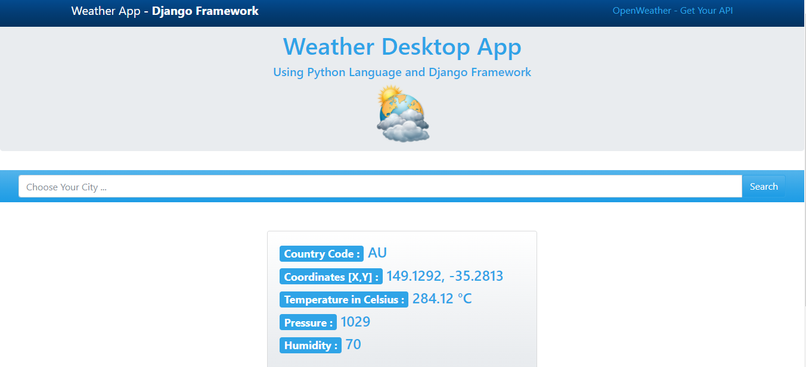

# Weather App



## Table of Contents

- [Description](#description)
- [Features](#features)
- [Demo](#demo)
- [Installation](#installation)
- [Usage](#usage)
- [API](#api)
- [Technologies Used](#technologies-used)
- [Contributing](#contributing)
- [License](#license)
- [Contact](#contact)

## Description

The Weather App is a web/mobile application that allows users to get real-time weather information for cities around the world. It provides users with current weather conditions, temperature, humidity, wind speed, and other relevant weather data. The app uses the OpenWeatherMap API to fetch weather data for the user's selected location.

## Features

- Search for weather information of any city in the world
- View current weather conditions, temperature, humidity, wind speed, and more
- Intuitive and user-friendly interface
- Responsive design for seamless use on both desktop and mobile devices

## Demo

You can try out the live demo of the Weather App [here](https://your-weather-app-demo-url.com).

## Installation

To run the Weather App locally on your machine, follow these steps:

1. Clone this repository to your local machine using:

   ```
   git clone https://github.com/yourusername/weather-app.git
   ```

2. Navigate to the project directory:

   ```
   cd weather-app
   ```

3. Install the project dependencies:

   ```
   npm install
   ```

## Usage

1. Obtain an API key from [OpenWeatherMap](https://openweathermap.org/) by signing up for a free account.
2. In the project, create a `.env` file and add your API key as follows:

   ```
   API_KEY=your_openweathermap_api_key
   ```

3. Run the application:

   ```
   npm start
   ```

4. Open your web browser and visit `http://localhost:3000` to access the Weather App.

## API

The Weather App uses the OpenWeatherMap API to fetch weather data. You can find more information about their API [here](https://openweathermap.org/api).

## Technologies Used

- HTML5, CSS3, JavaScript
- python and django
- Axios (for making API requests)
- OpenWeatherMap API

## Contributing

If you would like to contribute to the Weather App, you can follow these steps:

1. Fork the repository.
2. Create a new branch for your feature: `git checkout -b feature-name`
3. Make the necessary changes and commit them: `git commit -m "Add feature"`
4. Push to the branch: `git push origin feature-name`
5. Submit a pull request to the main repository.

## License

The Weather App is open-source software licensed under the [MIT License](LICENSE).

## Contact

If you have any questions or feedback, feel free to reach out to me:

- Email: your.email@example.com
- Twitter: [@yourusername](https://twitter.com/GideonI59562)
- GitHub: [yourusername](https://github.com/Codeon247)
